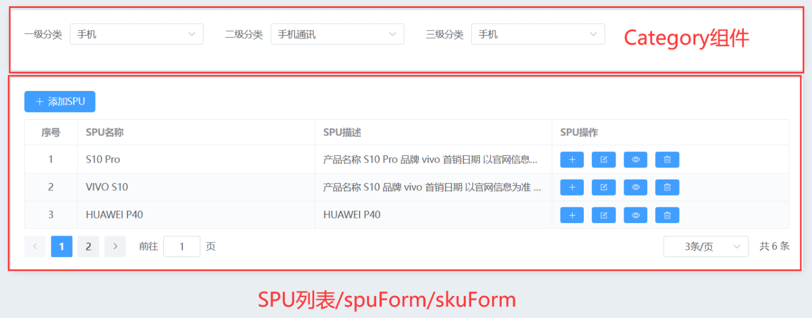
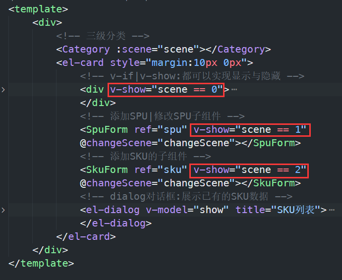
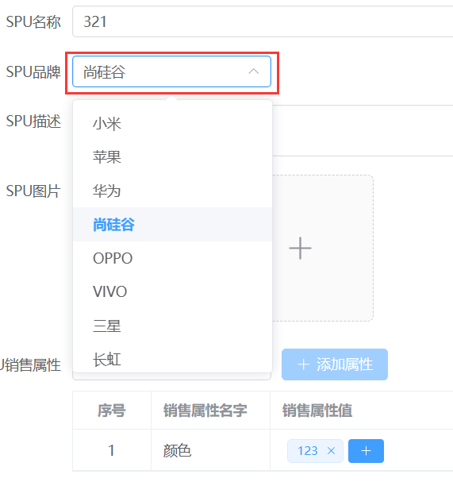
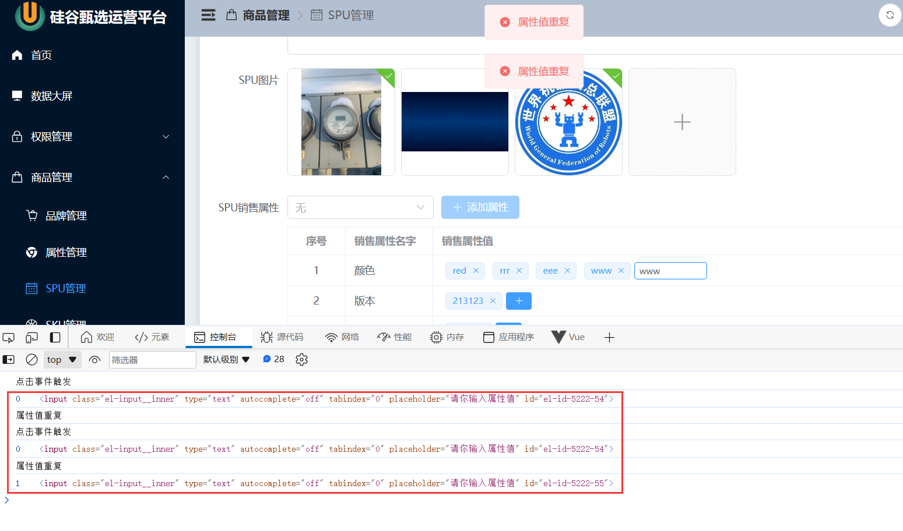

## 场景切换

SPU组件总体分为两个部分, 上面是公共组件Category

下面默认是SPU列表, 当点击添加/修改SPU按钮时切换为"spuForm"子组件, 当点击添加sku按钮时切换为"skuForm"子组件.



三者的切换使用一个枚举状态变量配合`v-show`来进行, 因为三者可能频繁切换,所以使用v-show提高性能.



```js
//控制场景切换
let scene = ref<number>(0); //0:显示已有SPU  1:添加或者修改已有SPU 2:添加SKU的结构
```

在spuForm子组件和skuForm子组件中都有保存/取消按钮用于切换回spu列表, 所以点击保存/取消按钮后需要将父组件中的`scene`状态量值变为0. 

有两种做法: 一种是利用v-model直接在子组件中更新父组件的`scene`的值, 另一种是利用自定义事件,点击保存/取消按钮后触发自定义事件来修改.

两种方法的区别是: v-model更方便, 但是自定义事件可以传递多个数据. 

由于spuForm子组件同时具有添加和修改SPU两种功能,添加后返回spu列表页重新请求spu列表时需要回到第一页,而修改后返回spu列表重新请求spu列表时仍然请求的是所修改spu所在的页 ,所以子组件还需要给父组件传递一个变量用来标识是添加还是修改, 所以使用自定义事件较好.

>spuForm:
>
>添加: 重新请求第一页列表
>
>修改: 重新请求本来页的spu列表
>
>取消: 重新请求本来页的spu列表(可以仅切换不重新请求, 为了代码简便)
>
>skuForm:
>
>保存: 重新请求本来页的spu数据列表.
>
>取消: 重新请求本来页的spu列表(可以仅切换不重新请求, 为了代码简便)

1. 给spuForm和skuForm子组件添加自定义事件及其回调:

   ```vue
   <SpuForm ref="spu" v-show="scene == 1" @changeScene="changeScene"></SpuForm>
   <SkuForm ref="sku" v-show="scene == 2" @changeScene="changeScene"></SkuForm>
   ```

   ```js
   //obj: {flag:number,params: string }
   const changeScene = (obj: any) => {
       //子组件Spuform点击取消变为场景0:展示已有的SPU
       scene.value = obj.flag;
       if (obj.params == 'add') {
           //添加留在第一页
           getHasSpu();
       } else {
           //更新留在当前页
           getHasSpu(pageNo.value);
       }
   }
   ```

2. 在子组件的取消按钮回调函数中触发自定义事件:

   spuForm.vue

   ```js
   //点击取消按钮:通知父组件切换场景为0,展示有的SPU的数据
   const cancel = () => {
       $emit('changeScene', { flag: 0});
   }
   //保存按钮的回调
   const save = async () => {
           ......
           //通知父组件切换场景为0
           $emit('changeScene', { flag: 0, params: SpuParams.value.id ? '' : 'add' });
           ......
   }
   ```

   skuForm.vue

   ```js
   //点击取消按钮:通知父组件切换场景为0,展示有的SPU的数据
   const cancel = () => {
       $emit('changeScene', { flag: 0});
   }
   //保存按钮的回调
   const save = async () => {
           ......
           //通知父组件切换场景为0
           $emit('changeScene', { flag: 0})
           ......
   }
   ```

   还有一个问题, spuForm组件怎么知道自己是在添加还是修改呢:

   如果是添加,则spuForm组件中的`SpuParams.value.id`是为空的, 如果是修改, 则会将所要修改的spu的数据传给spuForm组件, 这种情况下的`SpuParams.value.id`是有值的, 所以可以在触发自定义事件时以此来判断传入什么值:

   ```js
   //保存按钮的回调
   const save = async () => {
           ......
           //通知父组件切换场景为0
           $emit('changeScene', { flag: 0, params: SpuParams.value.id ? 'update' : 'add' });
           ......
   }
   ```

   由于对取消按钮做了简化,使其与保存按钮行为一致, 所以切换回spu列表页就分为两种情况: 重新请求第一页还是原来页的数据

   那么可以在SPU父组件中定义一个枚举状态量来进行标志, 然后利用v-model将这个值传给需要的子组件,在需要的时候直接修改这个状态量.然后在切换回spu列表页时, 以这个状态量来决定重新请求哪一页的spu列表.

   >具体操作: 修改spu和添加sku后切换回spu列表页时都直接请求原来页,所以仅在点击这两个按钮时在回调中将状态量设为0即可.
   >
   >而添加spu则是在点击"添加spu"时将状态量设为1,这样在点保存按钮后会重新请求第一页列表,然后在取消按钮的回调中将状态量设为0即可.


​	保存按钮禁用情况:

​	当属性列表为空时禁用保存按钮.

```vue
<el-button :disabled="!saleAttr.length"@click="save">保存</el-button>
```


## 数据重置与数据请求

在每次切换至spuForm组件之前需要先将spuForm组件中上次遗留的数据进行重置然后请求相关数据.

由于是利用v-show进行的组件切换,所以spuForm组件不会被卸载和重新挂载,无法在生命周期钩子中进行重置.

可以将数据重置与数据请求封装进spuForm组件的函数中, 然后利用组件引用来在父组件的相关按钮回调中进行调用.

spuForm组件:

```js
//点击修改spu时初始化数据函数
const initHasSpuData = async (spu: SpuData) => {
    //存储已有的SPU对象,将来在模板中展示
    SpuParams.value = spu;
    //spu:即为父组件传递过来的已有的SPU对象[不完整]
    //获取全部品牌的数据
    let result: AllTradeMark = await reqAllTradeMark();
    //获取某一个品牌旗下全部售卖商品的图片
    let result1: SpuHasImg = await reqSpuImageList((spu.id as number));
    //获取已有的SPU销售属性的数据
    let result2: SaleAttrResponseData = await reqSpuHasSaleAttr((spu.id as number));
    //获取整个项目全部SPU的销售属性
    let result3: HasSaleAttrResponseData = await reqAllSaleAttr();
    //存储全部品牌的数据
    AllTradeMark.value = result.data;
    //SPU对应商品图片
    imgList.value = result1.data.map(item => {
        return {
            name: item.imgName,
            url: item.imgUrl
        }
    })
    //存储已有的SPU的销售属性
    saleAttr.value = result2.data;
    //存储全部的销售属性
    allSaleAttr.value = result3.data;
}

//点击添加spu时初始化数据函数
const initAddSpu = async (c3Id: number | string) => {
    //清空数据
    Object.assign(SpuParams.value, {
        category3Id: "",//收集三级分类的ID
        spuName: "",//SPU的名字
        description: "",//SPU的描述
        tmId: '',//品牌的ID
        spuImageList: [],
        spuSaleAttrList: [],
    });
    //清空照片
    imgList.value = [];
    //清空销售属性
    saleAttr.value = [];
    saleAttrIdAndValueName.value = '';
    //存储三级分类的ID
    SpuParams.value.category3Id = c3Id;
    //获取全部品牌的数据
    let result: AllTradeMark = await reqAllTradeMark();
    //获取全部销售属性
    let result1: HasSaleAttrResponseData = await reqAllSaleAttr();
    //存储数据
    AllTradeMark.value = result.data;
    allSaleAttr.value = result1.data;
}
```

添加:将SpuParams中数据都置空,然后将传入的c3ID进行保存:`SpuParams.value.category3Id = c3Id;`

修改:直接将SpuParams对象整体替换为传入的spu对象:`SpuParams.value = spu;`	

然后请求相关数据.

## 品牌选择器默认选中spu所属品牌



请求到所有品牌数据后, 利用v-for将所有品牌名称渲染成品牌选择器的options,label为品牌名称,value为品牌id.

这样就可以利用select的v-model来将`SpuParams.tmId`传入select, 从而选中`SpuParams.tmId`id对应的品牌名称.


## 照片墙

照片墙需要具有以下功能:

展示原本已有照片和上传照片之后将上传的照片数据添加到照片列表数据中并且在照片墙中展示

这些功能都可以利用el-upload的`v-model:file-list`属性来实现, 将此属性绑定到照片列表数据, 这样就会在照片墙中展示照片列表.

而且在上传照片后, 上传的照片数据还会自动添加至照片列表数据中.

```js
v-model:file-list="imgList"
```

但是注意, el-upload组件对照片数据的格式有要求:

```js
{
    name: 'food.jpeg',
    url: 'https://fuss10.elemecdn.com/3/63/4e7f3a15429bfda99bce42a18cdd1jpeg.jpeg?imageMogr2/thumbnail/360x360/format/webp/quality/100',
  },
```

照片数据格式必须是这样, 与接口要求的图片数据格式不一致, 所以在请求照片数据列表后和将数据列表数据传给接口时需要转换数据格式.

>照片列表数据最好单独定义,不直接使用接口参数中的` SpuParams.value.spuImageList`,方便转换数据格式.

请求数据时:

```js
imgList.value = result1.data.map(item => {
        return {
            name: item.imgName,
            url: item.imgUrl
        }
    })
```

发送请求时:

```js
//整理照片墙的数据
    SpuParams.value.spuImageList = imgList.value.map((item: any) => {
        return {
            imgName: item.name,//图片的名字
            imgUrl: (item.response && item.response.data) || item.url
        }
    });
```

已有图片的url可以直接使用, 新增图片的url为本地地址, 但其中的response属性为远程地址,所以要用这个属性来转换为imgUrl.

## 销售属性修改与新增

### 新增

计算出此spu未有的销售属性:

```js
let unSelectSaleAttr = computed(() => {
    //全部销售属性:颜色、版本、尺码
    //已有的销售属性:颜色、版本
    let unSelectArr = allSaleAttr.value.filter(item => {
        return saleAttr.value.every(item1 => {
            return item.name != item1.saleAttrName;
        });
    })
    return unSelectArr;
})
```

利用v-for将unSelectSaleAttr数组渲染为新增属性选择器的options.

收集所选的新增属性:

由于接口同时需要新增属性的id和名称,所以option的value属性可以同时收集这两个值

```vue
 <el-option :value="`${item.id}:${item.name}`" v-for="(item, index) in unSelectSaleAttr" :key="item.id" :label="item.name"></el-option>
```

select的v-model绑定一个单独的值用于收集所选option的value:

```vue
 <el-select v-model="saleAttrIdAndValueName">
```

当点击"添加属性"时触发按钮回调:

```js
//添加销售属性按钮回调
const addSaleAttr = () => {
    /*
    "baseSaleAttrId": number,
    "saleAttrName": string,
    "spuSaleAttrValueList": SpuSaleAttrValueList
    */
    const [baseSaleAttrId, saleAttrName] = saleAttrIdAndValueName.value.split(':');
    //准备一个新的销售属性对象:将来带给服务器即可
    let newSaleAttr: SaleAttr = {
        baseSaleAttrId,
        saleAttrName,
        spuSaleAttrValueList: [],
        //用于自动聚焦
        flag: true,
        saleAttrValue: ''
    }
    //追加到数组当中
    saleAttr.value.push(newSaleAttr);
    //自动聚焦
    nextTick(() => {
        inputRefs.value[saleAttr.value.length - 1].focus();
    })
    //清空收集的数据
    saleAttrIdAndValueName.value = '';

}
```

当选择器未选择"需要新增的销售属性"时"添加属性"按钮需禁用:

```vue
<el-button @click="addSaleAttr" :disabled="saleAttrIdAndValueName ? false : true">
```

添加属性后默认聚集到属性列表最后一行的输入框:

在创建的新的销售属性对象中直接带上`flag`和`saleAttrValue`两个属性, 并且在将此属性追加到数组后利用inputRefs聚焦length-1:

```js
//追加到数组当中
    saleAttr.value.push(newSaleAttr);
    //自动聚焦
    nextTick(() => {
        inputRefs.value[saleAttr.value.length - 1].focus();
    })
```


### 修改

点击"添加属性值"按钮时此按钮变为输入框且自动聚焦到输入框,输入框失焦后判断非法情况, 合法则将此属性值整理数据后添加进此属性的属性值列表中,最后切换回"添加属性值"按钮.

非法情况:

输入为空,直接切换即可

与已有属性值重复:提醒后重新聚焦到输入框.


当点击添加按钮后,向本行对应的数据对象row中追加两个属性:`flag`用于切换编辑/展示模式, `saleAttrValue`用于暂时保存输入的新增属性值

创建变量inputRefs用于保存列表中的输入框元素引用,用于聚焦.因为每行只会有一个输入框,所以可以利用索引进行聚焦.

```vue
<el-input @blur="toLook(row, $index)" v-model="row.saleAttrValue" v-if="row.flag == true" :ref="(vc) => inputRefs[$index] = vc"></el-input>
<el-button @click="toEdit(row, $index)" v-else></el-button>
```

```js
//属性值添加按钮的点击事件
//输入框组件引用列表,用于聚焦输入框
const inputRefs = ref([]);
const toEdit = (row: SaleAttr, $index) => {
    //点击按钮的时候,input组件不就不出来->编辑模式
    row.flag = true;
    //聚焦输入框
    nextTick(() => {
        inputRefs.value[$index].focus();
    })
    row.saleAttrValue = ''
}
//表单元素失却焦点的事件回调
const toLook = (row: SaleAttr, $index) => {
    //整理收集的属性的ID与属性值的名字
    const { baseSaleAttrId, saleAttrValue } = row;
    //整理成服务器需要的属性值形式
    let newSaleAttrValue: SaleAttrValue = {
        baseSaleAttrId,
        saleAttrValueName: (saleAttrValue as string)
    }

    //非法情况判断
    if ((saleAttrValue as string).trim() == '') {
        ElMessage({
            type: 'error',
            message: '属性值不能为空的'
        })
        row.flag = false;
        return;
    }
    //判断属性值是否在数组当中存在
    let repeat = row.spuSaleAttrValueList.find(item => {
        return item.saleAttrValueName == saleAttrValue;
    })

    if (repeat) {
        ElMessage({
            type: 'error',
            message: '属性值重复'
        })
        //重新聚焦
        inputRefs.value[$index].focus();
        return;
    }


    //追加新的属性值对象
    row.spuSaleAttrValueList.push(newSaleAttrValue);
    //切换为查看模式
    row.flag = false;
}
```

自动聚焦有个bug:

当点击其它"添加属性值"按钮而导致输入框失焦, 并且输入非法:与已有属性值重复, 那么就会执行三次blur的回调函数, 两次是原本输入框的,一次是点击的按钮对应的输入框的.并且与点击事件的触发顺序如下:



原因未知.


## 多个关联的选择器数据收集

需要将多个关联的选择器的数据收集到数组中, 数组元素为`{选择器id:xxx,已选选项id:xxx}`

多个选择器和其options肯定是利用v-for渲染出来的,所以可以将`已选选项id`直接保存在选择器数据对象中,最后遍历数组将数据整理为想要的格式.

https://www.bilibili.com/video/BV1Xh411V7b5?t=213.6&p=93